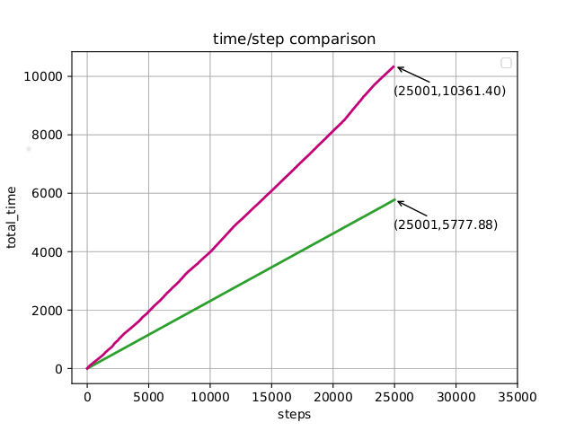
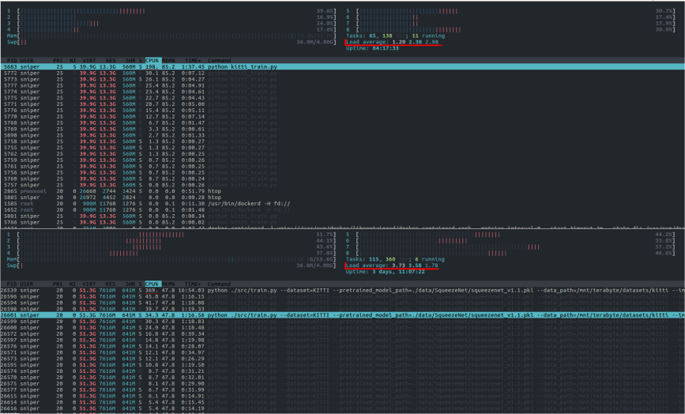
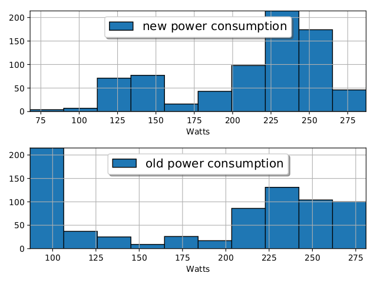

# SqueezeDetTL  [](https://github.com/vsergeev/python-periphery/blob/master/LICENSE)
Transfer Learning with SqueezeDet and more

## Introduction
SqueezeDet is a neural network algorithm used for detecting objects in systems with little memory and is tested in automotive applications. For more information about the SqueezeDet algorithm you can refer to: the [original SqueezeDet code](https://github.com/BichenWuUCB/squeezeDet) and the [SqueezeDet paper publication](https://arxiv.org/abs/1612.01051). In this repository we provide code for training and/or retraining SqueezeDet like architectures faster in all datasets like PASCAL VOC, MS COCO and KITTI without need for convertion with (for example) the vod-converter. We also support hyperparameter optimization through dlib optimization functions. The implementation is based fully on Tensorflow eliminating the requirement for other libraries (e.g. openCV) in the application code, after the training. So the user can use SqueezeDet as a black box by exporting its graph in any programming language supported by Tensorflow and without writting any other special code. Furthermore, the architecture is using the KISS principle. 

Summing all them in a list, this repository has to offer these in addition to the original mentioned above:

- 1.8 x faster training/retraining
- Support of PASCAL VOC, KITTI, MS COCO type of annotation datasets
- Support of all models using convDet (user can add more)
- Automatic hyperparameter optimization
- Models need only Tensorflow to be implemented
- Use of SqueezeDet like models as a black box in applications
- Automatic anchor shapes selection (see: )
- KISS type of architecture, user can add features easily
- Supporting methods of Transfer Learning (copying/freezing/retraining/changing/adding layers)
- Models exportable to Caffee
- Train/Retrain simply, just by modifying `json` files


The initial SqueezeDet training is only benchmarked in the KITTI dataset, in this repo there examples of using SqueezeDet for PASCAL VOC subsets. There were efforts to train the SqueezeDet in the whole PASCAL VOC dataset but they were all failures, as others have also tried, the PASCAL VOC dataset has objects with many diverse features and a few examples to support them, so the SqueezeDet cannot handle this diversity as it has very few parameters. That is at least the author's point of view...


For more information about the experiments and to know more about the use of this framework in Transfer Learning from KITTI to PASCAL VOC subsets, or even what makes it `1.8 x` faster there is a link to [this preprint academic work](https://arxiv.org/abs/1811.04863v1) which answers all these questions. If you are using it in any publications, please consider citting
it as below:

```
@article{athanasiadis2018framework,
  title={A Framework of Transfer Learning in Object Detection for Embedded Systems},
  author={Athanasiadis, Ioannis and Mousouliotis, Panagiotis and Petrou, Loukas},
  journal={arXiv preprint arXiv:1811.04863},
  year={2018}
}
```

## Fully GPU SqueezeDet Implementation
Even if you dont want to do transfer learning and want to just train/use SqueezeDet, this repo has to offer a faster implementation of SqueezeDet training. The initial implementation could not use today's Tensorflow functionality. So, it was largely based on Numpy and openCV to solve many issues. This had the drawback that the system used too much CPU power and also it required transfering large memory chunks from GPU to the CPU and vice versa. In this Tensorflow implementation, we eliminated this transfering by using the GPU as much as possible without unessesary memory transfers. To achieve this, the code for anchor matching was parallelized and transformed in Tensor form. For more, please read refer to the academic work above.

We also accelerated other functions, by using less memory. So, that the new implementation uses less memory and is also faster. Additionally, the user can use the CPU for other processes in a workstation or in a server and just let the GPU do all the work of training/retraining SqueezeDet. Figures 1-3 report memory usage and training speedups.

Speedup of new VS the old training implementation: 


As it can bee seen the speedup is 1.8X for every number of steps. The experiment of measuring the times is included in the tests/examples section below.

RAM usage and load of the new VS the old training implementation:


As it seems the new implementation (up) has lower load average than the old implementation (down).

GPU power consumption of the new VS the old training implementation:


The GPU power consumption of the new implementation (up) is greater than the old (down), which prooves that the new implementation is more GPU heavy.

## Using it in applications
To use SqueezeDet in applications the only thing needed is for Tensorflow to make the model, a way to supply an input tensor to the Tensorflow model (if not Tensorflow tf.data) and if needed a way to visualize the result. There is an example included for this case as mentioned below in the [Examples & Tests](#Examples-&-Tests).

## JSON file training configuration
In order to use the framework you should provide a JSON file with the appropriate hyperparameters for the training. Some hyperparameters if they are left unspecified they are specified automatically by the framework using this [JSON configuration file](./src/config/configs/base_config.json). The specification of each hyperparameter and all its possible values are given inside [this file](./assets/explain_hyperparameters.md)

## Hyperoptimization
Hyperoptimization is made easy. Rather than declaring a variable in the json confuguration file:
```json
    "MY_VAR" : 20
```
Declare it as string describing it:
```json
    "MY_VAR" : {"HVALUE": "linspace(0,1,50)"},
```
If you want only integer values:
```json
    "MY_VAR" : {"HVALUE": "linspace(0,50,50)", "IS_INTEGER" : true},
```
But more functions than only `"linspace"` can be used!

Supporting functions are
+ `"logspace"` --> Which is translated to `np.logspace`.
+ `"arange"` --> Which is translated to `np.arange`.
+ `"linspace"` --> Which is translated to `np.linspace`.
+ `"array"` --> Which is translated to `np.array` for distinct values.

## Transfer Learning
The purpose of developing this repository was to ease the process of transfer learning with SqueezeDet and other SqueezeDet like architectures. When this was developed there was no other alternative at least to the author's knowledge implementing the training process fully inside the GPU and making the filtering easier and part of the computational graph.

The main challenge was to do the experiments described in [here](./scripts/tl_mini_experiment_kitti_pascal). In this experiment all layers of SqueezeDet are studied for their transferability. The result is what was expected that SqueezeDet is not transferable, but there is a whole interesting story behind this and it became a [paper](PAPER LINK). So if any more information is needed I think the paper will cover it. If still there are unanswered questions, please do not hesitate to send an [e-mail](#Contanct) to ask a question.

## Requirements
The code is written in __Python2.7__. So, the first thing you need, is to install python 2.7 to your system. 

For CPU: Use requirements_cpu.txt:
```
joblib
numpy
tensorflow>=1.0.0
lxml
google
logging
```

For GPU: Use requirements_gpu.txt:
```
joblib
numpy
tensorflow-gpu>=1.0.0
lxml
google
logging
```

With one command install the requirements:
```bash
cd <PATH TO THE REPOSITORY FOLDER>
pip -r install requirements_{gpu|cpu}.txt 
```

Notice that only Tensorflow is needed for model inference. 

## Usage
In order to use this framework the following steps are required:

From a terminal:
1. Download the repository: `` git clone https://github.com/supernlogn/squeezeDetTL``.
2. ``cd auto_ITL``
3. Install requirements ``pip -r install requirements_{gpu|cpu}.txt`` 
4. Change the directory mapping inside the [make_user_compatible.py](./make_user_compatible.py).
5. ``cd src/datasets/kitti-eval/``
6. ``make``
7. Write your own json file as in the [examples section](#Examples-&-Tests).
8. Launch ``auto_ITL.py --<your-json-file-path>``. You can copy an existing from [here](./scripts)
9. Wait...
10. Get your weights in your specified `BASE_DIR` folder.

## Examples & Tests
There are examples (which were also the tests for the framework functionality) that show what this framework is able of. To mention the we provide a list with short descriptions and links to each example.

1. [Train on KITTI with ImageNet weights:](./scripts/kitti_tests)
2. [Train on PASCAL VOC with ImageNet weights](./scripts/full_pascal_voc)
3. [Train on PASCAL VOC subset with ImageNet weights](./scripts/pascal_voc)
4. [Train on PASCAL VOC subset without ImageNet weights](./scripts/pascal_voc_alone)
5. [Optimize hyperparameters for PASCAL VOC training](./scripts/hopt_tests)
6. [Measure speed, of training](./scripts/measure_speed)
7. [Create an Application with PASCAL VOC weights](./scripts/application)
8. [Train on KITTI and export model and weights to Caffee](./scripts/kitti_caffee)
9. [Implement and train your own SqueezeDet like model](./scripts/new_model)
10. [Study the transferability of SqueezeDet layers from KITTI to a subset of PASCAL VOC](./scripts/tl_mini_experiment_kitti_pascal)

## Notes about the architecture
The architecture of this framework is mainly inspired by [this talk](https://www.youtube.com/watch?v=o9pEzgHorH0).
In many cases there is no point of writting a class to group stateless things. Moreover python treats a whole python file as a namespace to hide some functions and a function can be used as an object. The last allows using python as functional language becomes more clear. Of course, it seems that in the future versions OOP should be used in order to achieve more scalabality. 

## Contributing
Before doing any contribution, please ask in the issues tab. Even if you dont want to write code yourself and need a feature please mention it, but first read carefully to see if it is already there.

If by the way you are determined to write some code to add functionality to this framework, first see the [Notes about the architecture](#Notes-about-the-architecture) section. At last but not the least, all code should be __first added to the develop branch not directly to the master branch__.

## Acknowledgments
Ofcourse this work could not have been made without the contribution of others. For this Thesis I am very gratefull to many people who helped me throughout my work. These people are:

- Panagiotis Mousouliotis
- Loukas Petrou
- Kostantinos Panayotou
- Manos Tsardoulias

## Contanct
For contacting please send to: ath.ioannis94@gmail.com
